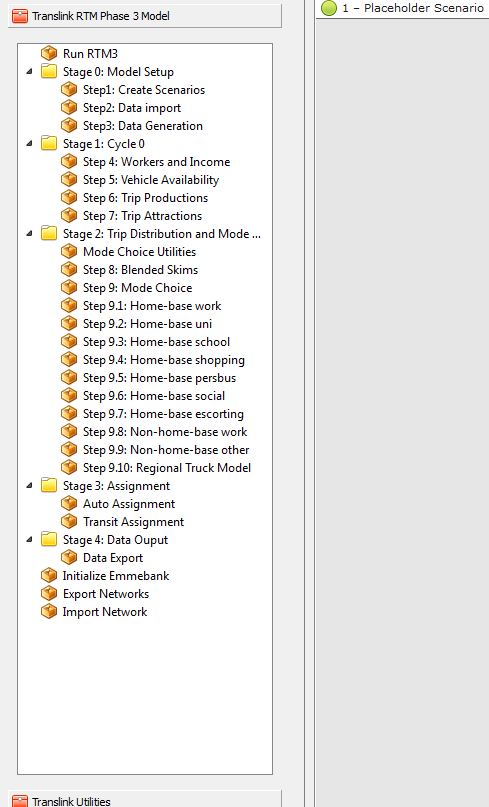
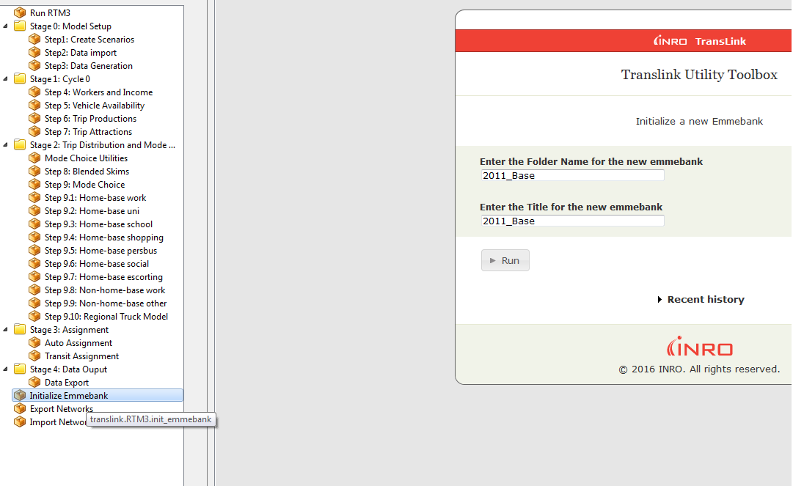

# Introduction

TransLink's Regional Transportation Model (RTM) is a comprehensive travel demand forecasting tool for
municipalities and/or districts in the GVRD and FVRD. The RTM estimates the 24-hour demand for various modes which include:

1. Auto
    + Single Occupancy Vehicle (SOV)
    + High Occupancy Vehicle (HOV)
2. Walk Access to Transit
    + Bus
    + Rail
    + West Coast Express (WCE)
3. Drive Access to Transit - Park and Ride
    + Bus
    + Rail
    + WCE
3. Active (not assigned to network)
    + Walk
    + Bike
4. Commercial Vehicles
    + Light Trucks (LGV)
    + Heavy Trucks (HGV)

The model has nine trip purposes:

1. Home-base Work
2. Home-base University
3. Home-base School
4. Home-base Shopping
5. Home-base Personal Business
6. Home-base Social-Recreational
7. Home-base Escorting (pick up and drop off)
8. Non-home-base Work
9. Non-home-base Other

The model assigns three main peak hour demands onto the network:

1. AM: 0730 - 0830
2. MD: 1200 - 1300
3. PM: 1630 - 1730

Peak hour active mode trips are calculated in the model, however, they are not assigned onto the network.

This User Guide provides details to the user regarding the various components of the model files delivered by TransLink. It is intended to provide a step - by - step
guide on how to setup a model run and details to take into consideration before running the model. This User Guide does not provide technical details about the sub-models
in the RTM3. These details, such as descriptions of the econometric models, will be provided in a comprehensive Model Documentation later in the year.


# Model Format

The model is now delivered as a collection of plain text files with an initial script to build the emmebank
in which the model is run. An EMME project file (.emp) is provided to reference all required folders and to link
in an empty, minimally sized databank in the Template/ folder. This is only provided to allow EMME modeller tools to
run before an RTM phase 3 databank has been initialized.

**RTM Phase 3 Folder Structure**

~~~
RTM.emp
BaseNetworks/
BaseNetworks/Inputs/
Documentation/
Logbook/
Media/
Scripts/
Template/
Views/
Worksheets/
~~~

## RTM.emp
This file contains all of the project information for the EMME model and allows the software
to reference all of the distributed folders consistently.

## BaseNetworks/
This folder contains all of the files required to build a databank and contains:

* Network batchin files for model years 2011, 2015, 2030 and 2045
* External demand matrices
* Definitions of ensembles, modes, transit vehicles
* Networks: Auto, Transit, Turns for 4 horizon years and 3 time periods
* Starter Skims
* External demand bike scores
* Calibration factors K-factors
* Ensembles

## BaseNetworks/Inputs/
This folder contains the default model assumptions for each model year; a copy
of this folder is placed with each databank initialized by the InitEmmebank tool. The folder includes the following:

* Demographics from metro Vancouver
* Dummies for town centres / other
* Geographics
* Park and Ride Assumptions such as parking price and capacity
* Batch input files used in truck model

It is important to note that all these TAZ-level attributes get stored in the Emmebank as origin-based matrices (mo). The previous
release stored attributes such as employment as destination-based matrices (md).

## Documentation/
A copy of the model userguide and other technical documentation.

## Logbook/
This folder holds the logbook information generated by EMME Modeller tools.

## Media/
Shapefiles used as background boundaries in EMME worksheets are provided here, layers for the following are provided:

* Zone Boundary for 1700 Zone System
* National Road Network Centerlines extracted for the modelled region
* Municipal Boundaries
* Zone Boundaries and Municipal Boundaries from the earlier 641 Zone System

## Scripts/
This folder contains the python scripts used to run the model.

## Template/
A minimally dimensioned EMME databank is distributed to allow Modeller tools to run before an RTM databank has been initialized.
No information is held in this template databank, it is provided only to allow Modeller to initialize an RTM databank from the provided text files.

## Views/
Definitions for some standard views are provided in the EMME environment. Standard views for the GVRD, FVRD, each GY aggregation and each municiaplity are provided.

## Worksheets/
Definitions for standardized worksheets can be saved in this folder.

# Receiving/Relocating a RTM Model

All file references have been updated to be relative to the provided EMME project file (RTM.emp). The only exception to this are
references to modeller python files in the EMME toolboxes. A batch file has been provided in Scripts/relocate_tools.bat to
link the toolboxes to the appropriate file if the project is moved.

This batch file must be run whenever the model is initially unpacked from a zip file, or whenever the project is moved to a different
folder on the hard disk. If this is not done, Modeller will not be able to run any of the RTM scripting.

If the following error is encountered when running this script:

~~~
Traceback (most recent call last):
  File "toolbox_modify.py", line 155, in <module>
    set_tools_to_current_root(toolbox_path, root_dir_name)
  File "toolbox_modify.py", line 129, in set_tools_to_current_root
    with ToolboxWrap(toolbox_path) as toolbox:
  File "toolbox_modify.py", line 60, in __init__
    self.documents = self.connection.execute('select * from documents').fetchall()
sqlite3.DatabaseError: file is encrypted or is not a database
~~~

It is likely that a Modeller instance is running and has locked the toolbox file. Close all Modeller instances and run the
script again.

## CSV Text Files
The csv input files for zone-based data has been introduced to provide a more convenient data format than the EMME batch-transaction files.
Zone based data intended for an mo or md matrix can now be entered using a format more usable with Excel and other external tools in a column-based format.
The first four rows are headers providing the following information, examples given are from the demographics input file:

* The mo or md matrix to store the data in  (mo10)
* The name for the EMME matrix (TotPop)
* The description for the EMME matrix (POP_Total)
* The column name in the SQL database where a copy of the data is kept (POP_Total)

The first column of data is the zone number the data values are intended for.

### Demographics Input File
The demographics input file contains the following data

|Matrix ID|EMME Name    |SQL NAME                    |Notes                                          |
|:-------:|:-------------|:---------------------------|:----------------------------------------------|
|mo10     |TotPop        |POP_Total                   |Total Population                               |
|mo11     |Pop0t4        |POP_0to4                    |Population Ages 0 to 4                         |
|mo12     |Pop5t12       |POP_5to12                   |Population Ages 5 to 12                        |
|mo13     |Pop13t17      |POP_13to17                  |Population Ages 13 to 17                       |
|mo14     |Pop18t24      |POP_18to24                  |Population Ages 18 to 24                       |
|mo15     |Pop25t34      |POP_25to34                  |Population Ages 25 to 34                       |
|mo16     |Pop35t54      |POP_35to54                  |Population Ages 35 to 54                       |
|mo17     |Pop55t64      |POP_55to64                  |Population Ages 55 to 64                       |
|mo18     |Pop65Up       |POP_65plus                  |Population Ages 65 plus                        |
|mo20     |TotEmp        |EMP_Total                   |Total Employment                               |
|mo21     |EmpConMfg     |EMP_Construct_Mfg           |                                               |
|mo22     |EmpFire       |EMP_FIRE                    |                                               |
|mo23     |EmpTcuWh      |EMP_TCU_Wholesale           |                                               |
|mo24     |EmpRet        |EMP_Retail                  |                                               |
|mo25     |EmpBoS        |EMP_Business_OtherServices  |                                               |
|mo26     |EmpAcFoInCu   |EMP_AccomFood_InfoCult      |                                               |
|mo27     |EmpHeEdPuAd   |EMP_Health_Educat_PubAdmin  |                                               |
|mo30     |EnrolElem     |Elementary_Enrolment        |Elementary School Enrollment                   |
|mo31     |EnrolSec      |Secondary_Enrolment         |Secondary School Enrollment                    |
|mo32     |EnrolPsFte    |PostSecFTE                  |Post Secondary Full Time Equivalent Enrollment |
|mo40     |TotHh         |HH_Total                    |Total Households                               |
|mo41     |Hh1p          |HH_1Person                  |1 Person Households                            |
|mo42     |Hh2p          |HH_2Person                  |2 Person Households                            |
|mo43     |Hh3p          |HH_3Person                  |3 Person Households                            |
|mo44     |Hh4pUp        |HH_4plusPerson              |4-plus Person Households                       |


### Geographics Input File
The demographics input file contains the following data

|Matrix ID|EMME Name|SQL NAME|Notes     |
|:-------:|:--------|:-------|:--------------------|
|mo50     |areahc   |Hectares             |Zone Area in Hectares                      |
|mo60     |prk2hr   |parking_two_hr_rate  |Two Hour Parking Rate                      |
|mo61     |prk8hr   |parking_eight_hr_rate|Eight Hours Parking Rate                   |
|mo69     |railStn  |rail_stn_dummy       |Zone contains a rail station (0/1)         |
|mo70     |cs250    |car_share_250m       |Zone has car share access within 250m (0/1)|
|mo71     |cs500    |car_share_500m       |Zone has car share access within 500m (0/1)|
|mo80     |bikesc   |bike_score_taz       |Bike Score (0-5)                           |

# Databank Initialization

Once the text files have been unpacked and the scripts relocated, open the EMME modeller toolbox and run the InitEmmebank tool,
this will allow an RTM Phase 3 Databank to be initialized and linked into the current project. The tool requires a folder name which
will be created, and the name of the databank to be shown in the project.


# Running the RTM Phase 3 Model


# Network Coding  \label{chap_network_coding}

## Modes

Modes are represented in the same manner as the Phase 2 model, with the addition of a new primary auto mode (v).
The primary auto mode and must be coded on any link that is expected to be used by any of the other auto modes.
This mode was added to allow the representation of limited access roadways such as bus or commercial vehicle only
lanes. In previous models the HOV mode was required to be allowed as well.

|Mode|Description|
|:--:|:----------|
|v   |Vehicles (Primary Auto Mode)         |
|c   |High Occupancy Vehicles (HOV)        |
|d   |Single Occupancy Vehicles (SOV)      |
|x   |Light Trucks                         |
|t   |Heavy Trucks                         |
|n   |Discourage Heavy Vehicle Traffic     |
|b   |Bus                                  |
|p   |Pedestrian                           |
|a   |Auxillary Transit Access             |
|l   |SkyTrain                             |
|r   |Commuter Rail (West Coast Express)   |
|s   |SeaBus                               |
|h   |Gondola                              |

## Link Types

Links have been classified by their basic role for data summary purposes.
There is currently no functional differences represented by the link type, but there may be in the future.

|Type|Description|
|:--:|:----------|
|1   |Centroid Connector            |
|2   |Pedestrian Links              |
|3   |Bowen Island Ferry            |
|100 |SkyTrain                      |
|101 |SeaBus                        |
|102 |West Coast Express            |
|103 |Gondola                       |
|200 |Bus Only                      |
|201 |HOV Lane                      |
|202 |Commercial Vehicle Access Only|
|300 |Freeway                       |
|301 |Highway                       |
|302 |Arterial                      |
|303 |Collector                     |
|304 |Local                         |
|305 |Ramp                          |
|306 |Highway Directional Ramp      |
|307 |Highway Loop Ramp             |
|310 |Other Roads                   |

## Extra Attributes

During a model run, a single master scenario is copied into 3 time of day specific scenarios for assignment.
The network parameters are coded in extra attributes in the master scenario and copied to the appropriate place
when the copies are made. A correspondence of from the master scenario to the time of day attributes is presented below.

Note that the posted speed attribute is not coded for each time of day, a single speed is used for all time periods.

|Master Scenario Attribute|     Time of Day Attributes    |
|:-----------------------:|:-------------------------------:|
|@posted_speed            |@posted_speed              |
|lanes                    |@lanesam, @lanesmd, @lanespm |
|vdf                      |@vdfam, @vdfmd, @vdfpm       |
|tpf                      |@tpfam, @tpfmd, @tpfpm       |
|tolls                    |@tollam, @tollmd, @tollpm    |
|hdwy                     |@hdwyam, @hdwymd, @hdwypm    |

## Network Modification Issues

### Issue 1 - Adding new Links
When adding new links that connect to a node defined as an intersection, be sure to review the new turns created as EMME will only auto-populate the tpf attribute, and not the time of day extra attributes, this could cause illogical turns to be allowed as the default value of the extra attribute is 0, which would disable all turns from or to the new link.
Also, make sure to populate the '@posted_speed' attribute. The streamlined vdf functions (see Appendix A) now require the modeller to input the posted speed for the new link.
When adding a new link, make sure to update the '@fareboundary' with a boolean value - 1 if the link crosses a fare zone and 0 if it doesn't.

### Issue 2 - Adding new Intersections
Similar to Issue 1, when newly defining an intersection, ensure the extra turn attributes are coded to match the automatically set tpf values, otherwise all turns will be disabled at that node (tpf=0)

### Issue 3 - Adding new Transit services
When adding new itineraries, make sure the extra headway attributes are populated as expected, or the effective headway of 0 will cause these services to be removed when constructing the time of day networks.

## Export Network Tool

Network coding should be done in the master scenarios only, as the time of day specific networks are overwritten
during each model run. The export network tool is responsible for exporting all required information from a scenario
for later import into the model run process. The dropdown area allows multiple scenarios to be exported at the same time.


## Import Network Tool

Additional network scenarios can be imported to the emmebank using the Import Scenarios tool. This tool assumes all required files
are in the BaseNetworks/ folder. The name of the scenario to be import is a user input.


# Scripts Folder

The Scripts folder contains the main toolboxes and python codes used for running the model. Figure \ref{fig_scripts_folder} shows the files
inside the folder.


## Util folder

The Util folder contains the Util toolbox and associated python script. The Util toolbox contains helper functions that
get used repeatedly within a model run. These helper functions are usually called from other Python Scripts. The Util method is usually called using the command:
util = _m.Modeller().tool("translink.util")

Examples of helper functions inside the Util method that get regularly called from the model's main scripts include:

 - Matrix Calculator : util.compute_matrix(<Arguments>)

 - Extra Attribute Calculator: util.emme_link_calc(<Arguments>)

 - Importing Matrix Data in Numpy Array format : util.get_matrix_numpy(<Arguments>)

These helper functions reduce the likelihood of making coding mistakes and make the overall code less repetitive and easier
to read.

## Phase3Scripts Folder

This folder contains the model's main python tool box and associated scripts. Figure \ref{fig_p3scripts_folder} is a screenshot of the Phase3Scripts folder.
The following is a brief description of each script in the order they appear in within the model run page. Each of the scripts in this folder has an object reference to the
Util toolbox as mentioned in the previous section.


### InitEmmebank.py
Creates a new databank which contains the building blocks of the model run:

1. Databank Size
2. Auto and Transit Networks for years 2011, 2015, 2030 and 2045
3. Ensembles
4. Functions
   + Volume-delay (vdf)
   + Turn penalty (tpf)
   + Transit time (ttf)

For more details, refer to Databank Initialization Section.

### 00_RunModel.py
This the main model run wrapper and launches the subsequent model scripts. Figure \ref{fig_model_run} is a screenshot of the run page with required user inputs:

1. Model horizon year:
    + 2011
    + 2015
    + 2030
    + 2045
2. Base Year Network Scenario:
    + Scen 1000 - 2011 Base Network
    + Scen 2000 - 2015 Base Network
    + Scen 3000 - 2030 Base Network
    + Scen 4000 - 2045 Base Network
3. Global Model Cycles
    + Default: 4
4. Demographics File
    + households
    + population
    + employment
5. Geographics File
    + parking
    + car share
    + rail station availability
6. Trip Distribution Model
    + Max Iterations Default: 60
    + Max Relative Difference Default: 0.0001
7. Assignment Convergence Criteria
    + Max Iterations Default: 200
8. Toggles for Congested/Capacitated Transit Assignment
    + Default: Enable Congested Transit Assignment
    + Default: Enable Capacited Transit Assignment
9. Number of Processors Specification
    + Default: number of CPUs in computer being used


### 01_CreateScenarios.py
Creates AM, MD and PM network scenarios from the main base year scenario. For example, if the user chose scenario 1000,
this script will create AM, MD and PM scenarios - typically scenarios 21000, 22000 and 23000 - with the relevant network attributes (e.g. bus priority
lanes and headways) by time of day.


### 02_DataImport.py
Imports/generates data used in a model run such as:

1. Values of Time
2. Transit perception Factors
3. External Demand and Trip Distribution K-Factors
4. Starter Skims

### 03_DataGeneration.py
Calculates attributes used in a model run such as:

1. Population and employment densities
2. Accessibility variables (e.g. number of jobs accessible from a zone within 30 minutes)

### 04_SocioEconomicSegmentation.py and 05_VehicleAvailability.py
These two scripts split household data provided by Metro-Vancouver into segments by household size x number of workers x Income Category x Auto Ownership
using a series of econometric logit models.

### 06_TripProductions.py and 07_TripAttractions.py
This is the trip generation phase of the model. It includes multiplying econometrically estimated, purpose-specific, production/attraction trip rates by household/population
and employment segments (depending on the trip purpose).

### 08_Blended_Skims
Takes AM, MD and PM auto and transit skims and blends them by trip purpose to create 'daily' skims to be used in the trip distribution and mode choice models

### 09-01_HbWork.py - 09-09_NhbOther.py
This series of nine scripts include the trip distribution, mode choice and time of day factoring models for each of the nine trip purposes.

### 09-00_ModeChoiceUtilities.py
Contains various helper functions that get used repeatedly in the trip distribution/mode choice models such as:

1. Trip distribution gravity model
2. Mode availability conditions

### 09-10_TruckModel.py
Runs the truck model and generates six origin - destination tables - 2 truck types (light and heavy) x three time periods

### 10-01_AutoAssignment.py
Runs the auto vehicle traffic assignment and generates time and cost skims for the three time periods

### 10-02_TransitAssignment.py
Runs the transit assignment (bus, rail and WCE) for the three time periods

Other scripts that are included in the Phase3Scripts but not part of a model run:

### 12_DataExport.py
Main model outputs are stored in a SQLite database inside the project folder as shown in Figure \ref{fig_sql_tables} (see rtm.db and trip_summaries.db).
This tool exports the data inside the SQLite database to .csv format inside the Outputs folder. The outputs include:

1. Trip summaries by mode, purpose and time of day at the aggregate and gy - gy level. Do note that daily trips at the gy - gy level are in Production - Attraction
   format whereas peak hour trips are in Origin - Destination format.
2. Network Summaries: Including VKT and travel times


### ImportNetwork.py and ExportNetwork.py
These two tools allow the import/export of current/future networks after they've been modified. More details are provided in the Step by Step Guide to running the model Chapter.

## Notes on the Use of Numpy and Pandas Python Libraries
Previous versions of the RTM relied largely on INRO's built in matrix calculator method throughout the full model run. In RTM3, most of these calculations are undertaken
instead using Python's built in Numpy and Pandas Libraries. The latest versions of the EMME software allows easy exchange of data between numpy and the Emmebank. For example,
if the number of households per zone is stored in Matrix 'mo1'(or 'md1'), the data can be stored in a vectorized Numpy array object of size 1741x1 (number of TAZs in the model)
using the command: X = emmebank.matrix("mo1").get_numpy_data(), where X is the array object. Once a calculation is completed, the result can be directly stored back
into the Emmebank using the command: emmebank.matrix("mo2").set_numpy_data(X).

Similar operations can be undertaken on full matrices except the array object would be of size 1741x1741.


The example below demonstrates a mode choice utility expression constructed using the matrix calculator and Numpy.

Matrix Calculator:

```
# mf100 and mf101 are time and cost coefficients.
Util_Transit = str(Bias) + "+" + str(Time_Coeff) + "*mf100"  + "+" + str(Cost_Coeff) + "*mf101"
```

Numpy:

```
Time =  emmebank.matrix("mf100").get_numpy_data()
Cost =  emmebank.matrix("mf101").get_numpy_data()

Util_Transit = Bias + Time_Coeff * Time + Cost_Coeff * Cost
```

The Numpy expression is explicit and analogous to the Emme macro language - in other words, it does what the modeller is asking it to do.

To summarize, below are a few advantages of using Numpy:

1) Code is succinct and easier to read since it does not require string concatenation
2) Reduces the amount of coding errors
3) Numpy is flexible and significantly faster than Matrix Calculator. This is especially important for complex models with many TAZs
4) Direct integration with Python's Pandas library which allows relational database/SQL type operations such as Join and Relate.This capability makes the management of complicated RTM submodels,
   such as Park and Ride, much easier.

Both the 'get' and 'set' Numpy methods are available in the 'Util' toolbox as helper functions. The two examples below show how these are invoked in the RTM:

Get Method: Array = util.get_matrix_numpy(<Arguments>)
Set Method: Array = util.set_matrix_numpy(<Arguments>)

For more information on Python Coding Guidelines, refer to Appendix XX of this User Guide.

# Step by Step Guide for Running the Model

This chapter provides a step by step guide for running the model. Two examples will be used:

1) Run a base year 2011 run
2) Run a future scenario run which includes demographic, auto and transit network changes.

Example 1 starts from the point the user receives the model files from TransLink. Example 2 focuses more on data inputs that need to be updated for running a future scenario.
Both examples provide screenshots to help guide the discussion.

## 2011 Model Run

This section provides a step by step guide to launching a base year, 2011, model run assuming no changes to model input data.

1.  Unzip folder received from TransLink. The folder contents will look similar to Figure \ref{fig_rtm_zip}
2.  Run the relocate_tools batch script found inside the Scripts folder. This script locates the python tools associated with the model run.
3.  Run RTM.emp to launch EMME. The Explorer will look similar to Figure \ref{fig_rtm_dbank} with one dummy scenario (Scenario 1)
4.  Launch EMME Modeller and go to 'Translink RTM Phase 3 Model' tool. The model utilities toolbox, 'Translink Utilities' can also be seen at the botton in
    Figure \ref{fig_rtm_tools}
5.  Launch the Initialize Emmebank tool. Enter a name for the title and folder name of the Emmebank you wish to create and click on the Run button
    (see Figure \ref{fig_rtm_init}).
6.  Close Modeller, the Explorer will now point to the newly created Emmebank which will include four scenarios, one for each horizon year, and associated networks
    as shown in Figure \ref{fig_post_init}. The newly created Emmebank folder, 2011_Base in this example, will look similar to Figure \ref{fig_emme_folder}.
    You will notice a copy of the Inputs folder that also exists in the 'RTM/BaseNetworks' directory.
7.  Launch Modeller and run the 'Run RTM3' tool inside the 'Translink RTM Phase 3 Model' toolbox.
8.  Fill out the user inputs as shown in Figure \ref{fig_model_run}. The user can change the inputs depending on the type of run being undertaken,
    however since this is a 2011 base year run the inputs will look laregely similar to the ones shown in the previous figure.
9.  Click the Run Button
10. Once a run is completed, run the Data Export tool under the Stage 4 subfolder and check the Export to CSVs toggle  as shown in Figure \ref{fig_data_export}. The csv outputs
    are stored in the 'Outputs' folder inside the Emmebank folder as shown in Figure \ref{fig_rtm_output}.







Warnings:

1. In the Model horizon years, make sure you only enter 2011, 2030 and 2045 as certain model components such as the truck model,
   external demand and bike scores were only setup for these years
2. Make sure the number of processors entered is less than or equal to what the machine supports

## 2030 Model Run

This section provides a step by step guide to setting up a horizon year, 2030, model run which includes the following input assumptions as part of the scenario:

 - Revised land-use data
 - New tolled facility
 - New Rail Line
 - New Park and Ride lot

Only steps requiring changes to the input data are included in this section. The user can refer to the previous section on how to launch a model run.

1. Revised Land-use data:
    + Generate a demographics file similar in format to the ones located inside the 'BaseNetworks/Inputs' directory (for example the taz1700_demographics_2030.csv file).
    + Very Important: Since this model is largely driven by household trip rates, make sure all appropriate demographic attributes are updated. For example, if the scenario modelled
   assumes a 20% population increase in Coquitlam, the number of households in that municipality should also be updated accordingly

2. New Tolled Facility
    + Make a copy of one of the four main scenarios (in this case we assume scenario 3000 is copied to scenario 3001).
    + Code the new tolled facility. Make sure to follow the Network Coding Guidelines described in Chapter \ref{chap_network_coding}.
    + Ensure all ramp sections are coded with the correct volume-delay functions and speeds (refer to Network Coding Guidelines described in Chapter \ref{chap_network_coding})
    + Add the appropriate tolls for each time period
    + Make sure turn penalty functions are coded properly for each time period and accounting for any turn restrictions

3. New Rail Line
    + Code the new rail line facility in scenario 3001. Make sure to follow the Network Coding Guidelines described in Chapter \ref{chap_network_coding}.
    + As this is a rail line, we strongly recommend coding it on separate, rail specific, links with pedestrian links connecting it to the main network.
    + Make sure to code AM, MD and PM headways
    + Make sure to allow boardings and alightings at rail station locations
    + If the service crosses a fare boundary, be sure to discuss with TransLink modelling staff the proposed fare increment amount.

4. New Park and Ride Lot
    + Code the new park and ride in scenario 3001. Make sure to follow the Network Coding Guidelines described in Chapter \ref{chap_network_coding}.
    + Make sure the lot number chosen ranges between 100 - 130 and is not one of the existing lots used in the model in the future. Unused lots are usually stored in the North-eastermost portion of the EMME network
   as shown in Figure <13_PnR.png>
    + Update the 'gn' ensemble in the 'taz1700_ensembles.csv' file inside the 'BaseNetworks/Inputs directory' - the proposed lot, say 129, gets a value of 3, which indicates this is a lot that only exists in the
   future
    + Update attributes associated with the lot, such as capacity, cost and terminal time (auxiliary time spent walking inside the parking lot to a bus/rail stop/station). The file is
   located at 'BaseNetworks/Inputs/taz1700_pnr.csv'


5. Export the Network
    + If Scenario 3001 becomes a main future year scenario that needs to be run repeatedly, the user can export the Scenario using the 'Export Networks' tool. The outputs will be stored inside the
   BaseNetworks folder as shown in Figure <14_BaseNetworks.png> The text files will be numbered with 3001. Afterwards, the InitEmmebank.py script can be updated to include scenario 3001 as part
   of the main horizon year networks as shown in Figure <15_InitEmmebank2.png>.


6. Final Checks before launching the run:
    +  Make sure to add new transit vehicles if required
    +  Make sure the correct seating and total capacities are provided in the transit vehicles table
    +  Make sure to update the Geography (or create a new) file located at '../RTM/BaseNetworks/Inputs' if needed. For example, in the New Rail Line scenario,
    the user will need to update the rail station dummy with a value of 1 for TAZs containing those stations.

7. Launch the model run following the steps described in the previous section.
8. To summarize Park and Ride results, the user will need to check SOV/HOV and transit peak hour trips that travel from/to zones 100 - 130.
   These trips are stored in the mf300 series (see Appendix XX for details on matrices stored in the databank).

# Appendix A: Volume Delay Function Definitions

el1 is set to the extra attribute @posted_speed

## Special Functions
$fd01 = length * 60 / 40$

$fd02 = 40 + ((volau + volad) - 100) * 60 / (volau + volad) * ((volau +  volad) .ge. 100)$

## Merge Functions
$fd03 = length * 60 / el1 + 0.85 * ((volau + volad) / ( 600*lanes))^5$

$fd04 = length * 60 / el1 + 0.85 * ((volau + volad) / ( 800*lanes))^5$

$fd05 = length * 60 / el1 + 0.85 * ((volau + volad) / (1000*lanes))^5$

$fd06 = length * 60 / el1 + 0.85 * ((volau + volad) / (1200*lanes))^5$

$fd07 = length * 60 / el1 + 0.85 * ((volau + volad) / (1400*lanes))^5$

## Controlled Intersection Functions
$fd25 = 0.25 + length * 60 / el1 + .85 * ((volau + volad) / (400 * lanes)) ^ 4$

$fd35 = 0.25 + length * 60 / el1 + .85 * ((volau + volad) / (600 * lanes)) ^ 4$

$fd45 = 0.25 + length * 60 / el1 + .85 * ((volau + volad) / (800 * lanes)) ^ 4$

$fd55 = 0.25 + length * 60 / el1 + .85 * ((volau + volad) / (1000 * lanes)) ^ 4$

$fd65 = 0.25 + length * 60 / el1 + .85 * ((volau + volad) / (1200 * lanes)) ^ 4$

$fd75 = 0.25 + length * 60 / el1 + .85 * ((volau + volad) / (1400 * lanes)) ^ 4$

## Free Flow Links
$fd85 = length * 60 / el1 * (1 + .6 * .85 * ((volau + volad) / (1600 * lanes ^ {1.05})) ^ 5)$

$fd88 = length * 60 / (el1 * 1.1) * (1 + .6 * .43 * ((volau + volad) / (1600 * lanes ^ {1.05})) ^ {5.25})$

# Appendix B: Matrix Ranges

|Type|Matrix Type|Matrix Series|Description|
|:--:|:------:|:--------:|:-------------------------------------------------------|
|ms    |Scalar         |1 - 99         |Model Inputs                                                 |
|ms    |Scalar         |100 - 150      |HOV Occupancy and Passenger Car Equivalents                  |
|ms    |Scalar         |160            |Transit One Zone Fare                                        |
|ms    |Scalar         |200 - 299      |Values of Time                                               |
|ms    |Scalar         |300 - 399      |Transit Perception Factors                                   |
|ms    |Scalar         |400 - 499      |Blended Skims Factors                                        |
|ms    |Scalar         |500 - 599      |Transit Fare Blended Skims Factor                            |
|ms    |Scalar         |8000 - 8099    |Truck Model Scalars                                          |
|mo    |Origin         |1 - 99         |Model Inputs                                                 |
|mo    |Origin         |100 - 199      |Geographic and Ensemble Dummies                              |
|mo    |Origin         |200 - 299      |Urban Form Variables such as densities and accessibilities   |
|mo    |Origin         |2000 - 2099    |Trip Productions                                             |
|mo    |Origin         |8000 - 8099    |Truck Model Productions                                      |
|md    |Destination    |2000 - 2099    |Trip Attractions                                             |
|md    |Destination    |8000 - 8099    |Truck Model Attractions                                      |
|mf    |Full           |1 - 99         |Model Inputs                                                 |
|mf    |Full           |200 - 299      |Person - trips by time of day                                |
|mf    |Full           |300 - 399      |Assigned trips by time of day (auto driver and transit)      |
|mf    |Full           |3000 - 3999    |Trip Distribution and Mode Choice Daily Trips by Trip Purpose|
|mf    |Full           |5000 - 5099    |Auto Assignment Skims by time of day                         |
|mf    |Full           |5100 - 5299    |Auto Assignment Blended Skims by Trip Purpose                |
|mf    |Full           |5300 - 5399    |Bus Assignment Skims by time of day                          |
|mf    |Full           |5400 - 5499    |Bus Assignment Blended Skims by Trip Purpose                 |
|mf    |Full           |5500 - 5599    |Rail Assignment Skims by time of day                         |
|mf    |Full           |5600 - 5699    |Rail Assignment Blended Skims by Trip Purpose                |
|mf    |Full           |5700 - 5799    |WCE Assignment Skims by time of day                          |
|mf    |Full           |5800 - 5899    |WCE Assignment Blended Skims by Trip Purpose                 |
|mf    |Full           |6000 - 6999    |Park and Ride Model chosen lot and skims                     |
|mf    |Full           |8000 - 8099    |Truck Model trips by market sector (daily and by time of day)|
|mf    |Full           |9000 - 9099    |Mode Choice Logsums by trip purpose                          |
|mf    |Full           |9100 - 9199    |Trip Distribution Friction Factors scratch matrices          |
|mf    |Full           |9200 - 9299    |Trip Distribution K-Factors                                  |
|mf    |Full           |9900 - 9999    |Temporary time of day skims storage                          |